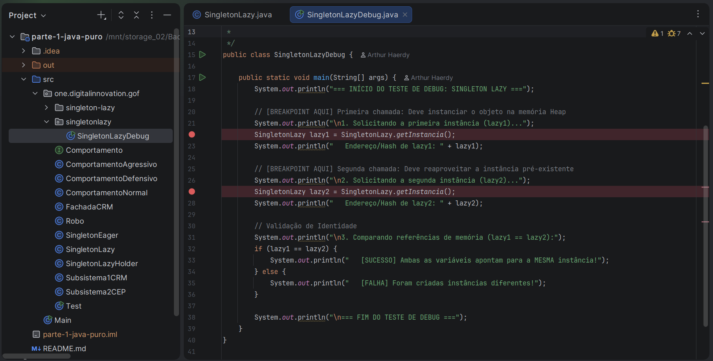

# Laboratório de Debugging: Singleton Lazy

Este documento apresenta a análise factual do fluxo de execução, alocação na Heap e inspeção de memória da variação **Singleton Lazy**, utilizando a classe `SingletonLazyDebug.java` localizada dentro do pacote `one.digitalinnovation.gof.singletonlazy`.

---

## 📌 1. Conceito do Padrão

O **Singleton Lazy** (Preguiçoso) adia a criação do objeto até o exato momento em que ele é requisitado pela primeira vez através do método estático `SingletonLazy.getInstancia()`.

* **Pacote Base:** `one.digitalinnovation.gof.SingletonLazy`
* **Pacote do Laboratório:** `one.digitalinnovation.gof.singletonlazy`
* **Vantagem:** Economia de recursos de memória e processamento na inicialização da aplicação (*lazy initialization*).

---

## 💻 2. Código-Fonte do Laboratório

### `SingletonLazyDebug.java`

```java
package one.digitalinnovation.gof.singletonlazy;

import one.digitalinnovation.gof.SingletonLazy;

/**
 * Classe utilitária para execução e inspeção em modo Debug do padrão Singleton Lazy.
 * 
 * Sugestão de Debug no IntelliJ IDEA:
 * 1. Insira um Breakpoint na primeira chamada de 'SingletonLazy.getInstancia()'.
 * 2. Insira um Breakpoint na segunda chamada de 'SingletonLazy.getInstancia()'.
 * 3. Execute via Debug (Shift + F9).
 * 4. Observe o valor das referências de memória no painel "Variables".
 * 
 * @author Arthur
 */
public class SingletonLazyDebug {

    public static void main(String[] args) {
        System.out.println("=== INÍCIO DO TESTE DE DEBUG: SINGLETON LAZY ===");

        // [BREAKPOINT AQUI] Primeira chamada: Deve instanciar o objeto na memória Heap
        System.out.println("\n1. Solicitando a primeira instância (lazy1)...");
        SingletonLazy lazy1 = SingletonLazy.getInstancia();
        System.out.println("   Endereço/Hash de lazy1: " + lazy1);

        // [BREAKPOINT AQUI] Segunda chamada: Deve reaproveitar a instância pré-existente
        System.out.println("\n2. Solicitando a segunda instância (lazy2)...");
        SingletonLazy lazy2 = SingletonLazy.getInstancia();
        System.out.println("   Endereço/Hash de lazy2: " + lazy2);

        // Validação de Identidade
        System.out.println("\n3. Comparando referências de memória (lazy1 == lazy2):");
        if (lazy1 == lazy2) {
            System.out.println("   [SUCESSO] Ambas as variáveis apontam para a MESMA instância!");
        } else {
            System.out.println("   [FALHA] Foram criadas instâncias diferentes!");
        }

        System.out.println("\n=== FIM DO TESTE DE DEBUG ===");
    }
}

```

---

## 🛠️ 3. Passo a Passo do Debugging no IntelliJ IDEA

### Passo 1: Configuração dos Breakpoints

Para acompanhar a criação do objeto e a verificação condicional, insira pontos de interrupção (*breakpoints*):

* No arquivo `SingletonLazyDebug.java`: Nas chamadas de `SingletonLazy.getInstancia()`.
* No arquivo `SingletonLazy.java`: Na linha `if (instancia == null)`.

<p align="center">
  
</p>
*Figura 1: Marcação dos pontos de interrupção no código `SingletonLazyDebug.java`*

---

### Passo 2: Primeira Chamada — `lazy1 = SingletonLazy.getInstancia()`

Execute a classe `SingletonLazyDebug` em modo **Debug (Shift + F9)**. Use `Step Into (F7)` para entrar no método da classe base.


*Figura 2: Inspeção do painel Variables. O atributo estático `instancia` possui valor inicial `null`.*

1. A condição `instancia == null` é avaliada como `true`.
2. O bloco entra na linha `instancia = new SingletonLazy();`.
3. A JVM aloca o novo objeto na memória Heap (ex: endereço/ID `@452`).

---

### Passo 3: Atribuição e Retorno de `lazy1`

Ao prosseguir o código (`Step Over - F8`), a variável local `lazy1` recebe o ponteiro do objeto recém-criado.


*Figura 3: Variável `lazy1` apontando para a instância `@452`.*

---

### Passo 4: Segunda Chamada — `lazy2 = SingletonLazy.getInstancia()`

Na chamada seguinte, a execução entra novamente em `getInstancia()`.


*Figura 4: Avaliação do `if (instancia == null)`. Como `instancia` já contém `@452`, a condição é `false`.*

1. A condição `instancia == null` falha (`false`).
2. A instrução `new SingletonLazy()` **é saltada**, evitando alocação duplicada na memória.
3. O método retorna diretamente a referência pré-existente (`instancia`).

---

### Passo 5: Validação da Identidade de Memória

Inspecionando o painel **Variables** ao término da execução:


*Figura 5: Comparação dos hashes no IntelliJ comprovando que `lazy1` e `lazy2` são idênticos.*

---

## 📊 4. Matriz de Rastreamento de Estado

| Passo | Instrução em `SingletonLazyDebug` | Estado de `instancia` | Avaliação do `if` | Ponteiro de Memória |
| --- | --- | --- | --- | --- |
| **1** | `SingletonLazy.getInstancia()` (1ª vez) | `null` | `true` (Cria novo) | `SingletonLazy@452` |
| **2** | Atribuição a `lazy1` | `SingletonLazy@452` | N/A | `lazy1 -> SingletonLazy@452` |
| **3** | `SingletonLazy.getInstancia()` (2ª vez) | `SingletonLazy@452` | `false` (Reaproveita) | `SingletonLazy@452` |
| **4** | Atribuição a `lazy2` | `SingletonLazy@452` | N/A | `lazy2 -> SingletonLazy@452` |

---

## ⚠️ 5. Observação Técnica (Concorrência / Threads)

Esta implementação básica **não é thread-safe**. Caso múltiplas *threads* acessem `getInstancia()` simultaneamente durante o estado inicial (`instancia == null`), há risco de condição de corrida (*race condition*), podendo instanciar mais de um objeto na memória. Para cenários *multithread*, utilize a variação **SingletonLazyHolder** ou sincronização por travamento.