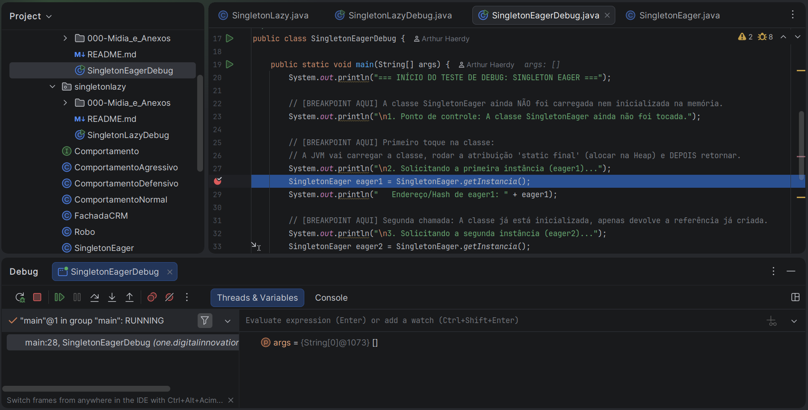
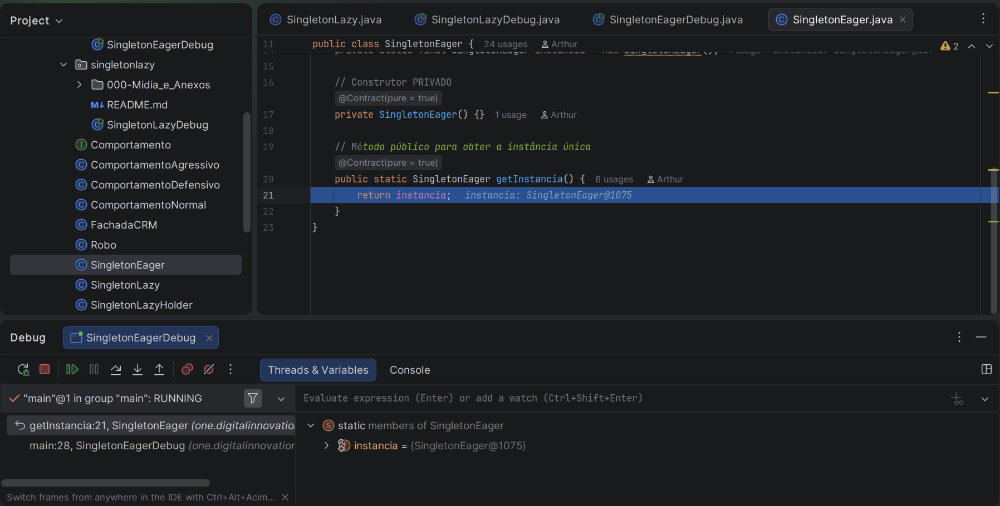
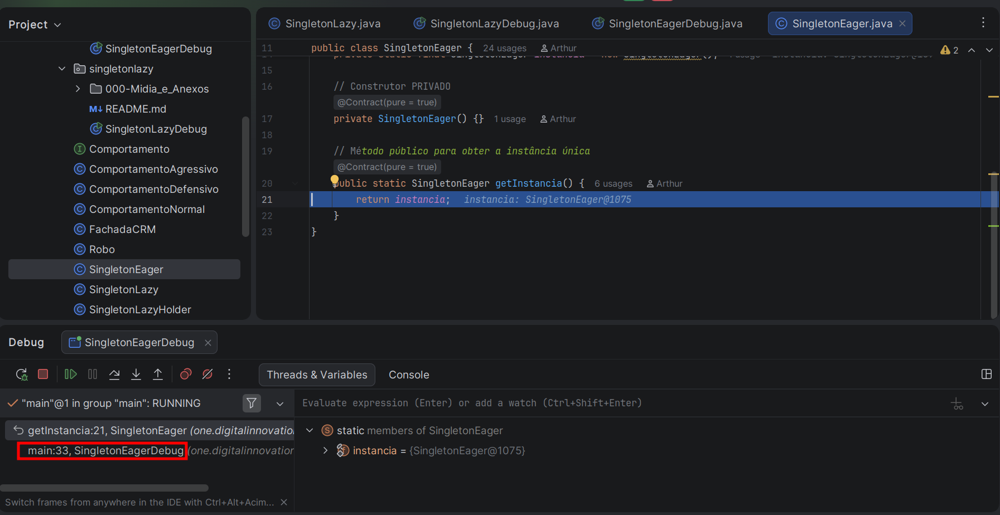
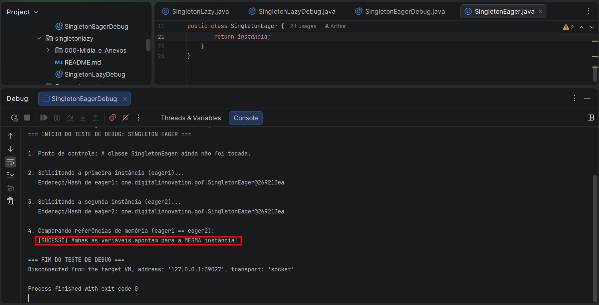

# Laboratório de Debugging: Singleton Eager

Este laboratório prático tem como objetivo inspecionar o ciclo de vida, a ordem de inicialização pela JVM e o comportamento de memória do padrão de projeto **Singleton Eager** (Inicialização Apressada/Ávida).

Acompanhando a execução passo a passo no **IntelliJ IDEA**, evidenciamos a mecânica da JVM ao executar o bloco de inicialização estática (`<clinit>`) e como a referência de memória é mantida única em toda a aplicação.

---

## 🛠️ Tecnologias e Ferramentas Utilizadas

* **Linguagem:** Java (JDK 17+)
* **IDE:** IntelliJ IDEA
* **Recursos do Depurador:** Breakpoints, *Step Into* (F7), *Step Over* (F8), Painel *Threads & Variables* e *Inline Hints*.

---

## 🔍 Estrutura do Código

O laboratório é composto por duas classes no mesmo pacote (`one.digitalinnovation.gof.singletoneager`):

1. **`SingletonEager.java`**: Implementação da classe Singleton com atributo estático e final inicializado imediatamente na declaração.
2. **`SingletonEagerDebug.java`**: Classe principal para execução e inspeção do fluxo via depurador.

```
src/
 └── one/
      └── digitalinnovation/
           └── gof/
                └── singletoneager/
                     ├── SingletonEager.java
                     └── SingletonEagerDebug.java

```

### Clase SingletonEager

```java
package one.digitalinnovation.gof;

/**
 * Singleton "Eager" (Ansioso).
 *
 * A instância é criada assim que a classe é carregada pela JVM,
 * mesmo que ninguém a tenha pedido ainda.
 * VANTAGEM: Thread-safe por natureza.
 * DESVANTAGEM: Consome memória mesmo se nunca for usado.
 */
public class SingletonEager {

    // A instância é criada IMEDIATAMENTE quando a classe é carregada
    private static final SingletonEager instancia = new SingletonEager();

    // Construtor PRIVADO
    private SingletonEager() {}

    // Método público para obter a instância única
    public static SingletonEager getInstancia() {
        return instancia;
    }
}
```

### Classe SingletonEagerDebug

```java
package one.digitalinnovation.gof.singletoneager;

import one.digitalinnovation.gof.SingletonEager;

/**
 * Classe utilitária para execução e inspeção em modo Debug do padrão Singleton Eager.
 *
 * Sugestão de Debug no IntelliJ IDEA:
 * 1. Insira um Breakpoint na instrução do System.out antes da primeira chamada.
 * 2. Insira um Breakpoint na linha do 'SingletonEager.getInstancia()'.
 * 3. [DICA DE OURO] Coloque também um Breakpoint na linha da variável 'instancia' dentro da classe SingletonEager.
 * 4. Execute via Debug (Shift + F9).
 * 5. Observe no painel "Variables" que a atribuição estática ocorre imediatamente na CARGA da classe.
 */
public class SingletonEagerDebug {

    public static void main(String[] args) {
        System.out.println("=== INÍCIO DO TESTE DE DEBUG: SINGLETON EAGER ===");

        // [BREAKPOINT AQUI] A classe SingletonEager ainda NÃO foi carregada nem inicializada na memória.
        System.out.println("\n1. Ponto de controle: A classe SingletonEager ainda não foi tocada.");

        // [BREAKPOINT AQUI] Primeiro toque na classe:
        // A JVM vai carregar a classe, rodar a atribuição 'static final' (alocar na Heap) e DEPOIS retornar.
        System.out.println("\n2. Solicitando a primeira instância (eager1)...");
        SingletonEager eager1 = SingletonEager.getInstancia();
        System.out.println("   Endereço/Hash de eager1: " + eager1);

        // [BREAKPOINT AQUI] Segunda chamada: A classe já está inicializada, apenas devolve a referência já criada.
        System.out.println("\n3. Solicitando a segunda instância (eager2)...");
        SingletonEager eager2 = SingletonEager.getInstancia();
        System.out.println("   Endereço/Hash de eager2: " + eager2);

        // Validação de Identidade
        System.out.println("\n4. Comparando referências de memória (eager1 == eager2):");
        if (eager1 == eager2) {
            System.out.println("   [SUCESSO] Ambas as variáveis apontam para a MESMA instância!");
        } else {
            System.out.println("   [FALHA] Foram criadas instâncias diferentes!");
        }

        System.out.println("\n=== FIM DO TESTE DE DEBUG ===");
    }
}
```

---

## 🚀 Passo a Passo da Depuração e Capturas de Tela

### 1. Ponto de Controle Anterior à Carga da Classe

#### 🟩 Ao iniciar a execução em modo Debug (`Shift + F9`), o programa pausa no primeiro breakpoint dentro do método `main`. Neste momento, a classe `SingletonEager` ainda não foi referenciada ou carregada pelo *ClassLoader* da JVM.

<p align="center">
  
</p>

---

### 2. Primeiro Toque na Classe e Execução do Bloco Estático (`<clinit>`)

#### 🟩 Ao avançar com *Step Into* (F7) na chamada `SingletonEager.getInstancia()`, a JVM identifica a referência a um membro estático da classe.

Antes de entrar no corpo do método `getInstancia()`, a JVM interrompe o fluxo normal para executar a inicialização estática:

1. Executa a instrução `private static final SingletonEager instancia = new SingletonEager();`.
2. Executa o construtor privado `SingletonEager()`, alocando o objeto na memória **Heap**.
3. Atribui o objeto alocado (ex: `SingletonEager@1075`) ao membro estático `instancia`.

<p align="center">
  
</p>

> **Nota de Inspeção:** Observe que ao entrar na linha `return instancia;`, o *inline hint* da IDE já exibe o objeto instanciado (ex: `instancia: SingletonEager@1075`). Isso confirma que a criação do objeto ocorreu na carga da classe, **antes** do retorno do método.

---

### 3. Segunda Chamada e Reutilização de Instância

#### 🟩 Na segunda chamada a `SingletonEager.getInstancia()`, como a classe já se encontra devidamente carregada e inicializada no ecossistema da JVM, a etapa de inicialização estática é ignorada. O método apenas retorna a referência existente guardada em memória.

<p align="center">
  
</p>

---

### 4. Confirmação de Identidade no Console

#### 🟩 Ao final da execução, o console exibe o hash de memória nativo gerado pelo `toString()` padrão da JVM (formato `NomeDaClasse@HashCodeHexadecimal`).

<p align="center">
  
</p>

---

## 💡 Destaques Técnicos & Mitos Desmistificados

### 🔹 ID do Debugger (`@1075`) vs. Hashcode do Console (`@269213ea`)

Durante a inspeção, é normal notar uma diferença entre a notação da IDE e o log do console:

* **`{SingletonEager@1075}` (Painel IDE):** É um *Object ID* sintético e sequencial gerado pelo agente do depurador do IntelliJ IDEA para facilitar a navegação visual do desenvolvedor.
* **`...SingletonEager@269213ea` (Console):** É o retorno do método `Object.toString()` executado pela JVM, composto pelo nome da classe acrescido do `hashCode()` do objeto em formato hexadecimal.

### 🔹 O Mito do "Consumo Indevido de Memória"

Muitos tutoriais afirmam que a abordagem *Eager* consome memória "mesmo sem a classe ser utilizada". Conforme comprovado neste laboratório:

* A JVM utiliza **Carga Sob Demanda** (*Lazy Loading* no nível da classe). O objeto Singleton **não** é alocado no momento em que a aplicação sobe no terminal.
* O objeto só é alocado no momento do **primeiro toque** na classe `SingletonEager`.
* A desvantagem de consumo antecipado só ocorre se a classe Singleton possuir **outros** membros estáticos (constantes, métodos utilitários) que sejam chamados sem a intenção explícita de obter a instância Singleton.

---

## ⚖️ Comparativo Prático: Singleton Eager vs. Singleton Lazy

Ambas as abordagens garantem a existência de uma única instância do objeto na memória Heap, mas possuem comportamentos distintos no ciclo de vida e no gerenciamento de concorrência:

| Característica | Singleton Eager (Ávido/Apressado) | Singleton Lazy (Preguiçoso) |
| --- | --- | --- |
| **Gatilho de Criação do Objeto** | No momento da **carga/inicialização da classe** pela JVM (execução do bloco estático `<clinit>`). | Na **primeira chamada explícita** ao método `getInstancia()` via checagem condicional (`if (instancia == null)`). |
| **Estado Inicial do Atributo Estático** | O atributo `instancia` já recebe a referência da memória Heap (`{SingletonEager@1075}`). | O atributo `instancia` inicia como **`null`** na carga da classe. |
| **Segurança em Ambientes Multithread (*Thread Safety*)** | **Nativamente Thread-Safe.** A JVM garante pela especificação (JLS §12.4.2) que a inicialização de classes e blocos estáticos seja sincronizada. | **Não é Thread-Safe** na sua implementação simples. Exige sincronização manual (`synchronized` ou *Double-Checked Locking*) para evitar *Race Conditions*. |
| **Complexidade do Código** | Mais simples e enxuta. A responsabilidade da criação é delegada à própria infraestrutura da JVM. | Exige controle de fluxo manual com verificações nulas e mecanismos de sincronização adicionais. |
| **Cenário Recomendado** | Aplicações onde o objeto é leve, ou em casos onde há certeza de que a instância será requisitada durante a execução do programa. | Objetos extremamente pesados (conexões de banco de dados, drivers de hardware) cuja criação deve ser postergada até o último momento possível. |